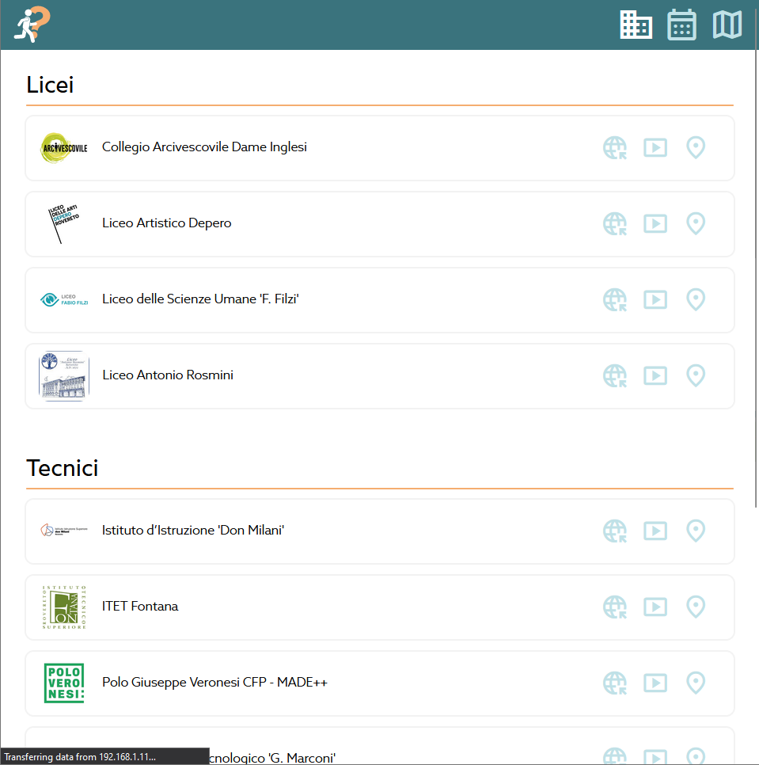
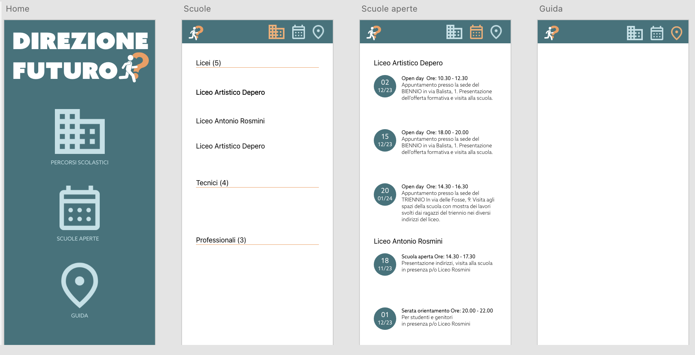

> /!\ BROKEN STUFF
> L'app per funzionare deve essere prima buildata in locale \
> _dovevamo usare nix, non docker..._

# MaDe Progetto Scuole

Sito web realizzato in collaborazione con il Liceo Artistico Depero,
lo scopo del sito è di centralizzare le informazioni sulle scuole superiori
disponibili nel territorio di Rovereto in un unico luogo

## Preview

Istituti page


Mobile overview


## Running project

Requirements:

- node (reccomended v19.5.0)
- docker (optional)

Notes:

- Default Server ip and port are `localhost:25565`
- Default App ip and port are `YOUR_LOCAL_IP:4321`
- If you want to set a custom server address and port \
  you need to edit `/Data/constants.ts` AND `/Data/constants.js` \

### Running dev

```bash
# Start server
cd ./Server
npm install
node index.js &

cd ..

# Start app
cd ./App
npm install
npm run dev -- --host
```

### Running production (by hand)

```bash
# Set local ip !!!
vim Data/constants.js
vim Data/constants.ts
###

# Start server
cd ./Server
npm install
node index.js &

cd ..

# Build app
cd ./App
npm install
npm run build

# You may now kill the server

# Start app
docker run -d \
-v /$(pwd)/dist:/usr/share/nginx/html \
--name webapp \
-p 80:80 \
nginx
```

### Using the build scripts

```bash
# Build and start server
cd ./Server
./server_run.sh

# Build app
cd ../App
npm install
npm run build
./app_run.sh
```

### Troubleshooting

#### App build failed fetch failed

Make sure you have the server up and running before starting the application

#### Server address not available

You probably forgot another instance running, check and retry

> You can use `sudo lsof -i :25565` (on windows) to find processes using the port

#### Images don't render when connected to App in LAN

The server manages media distribution, check your firewall if you have the required port open (default TCP:25565)

## Design concepts

Desktop landing page


Mobile overview

